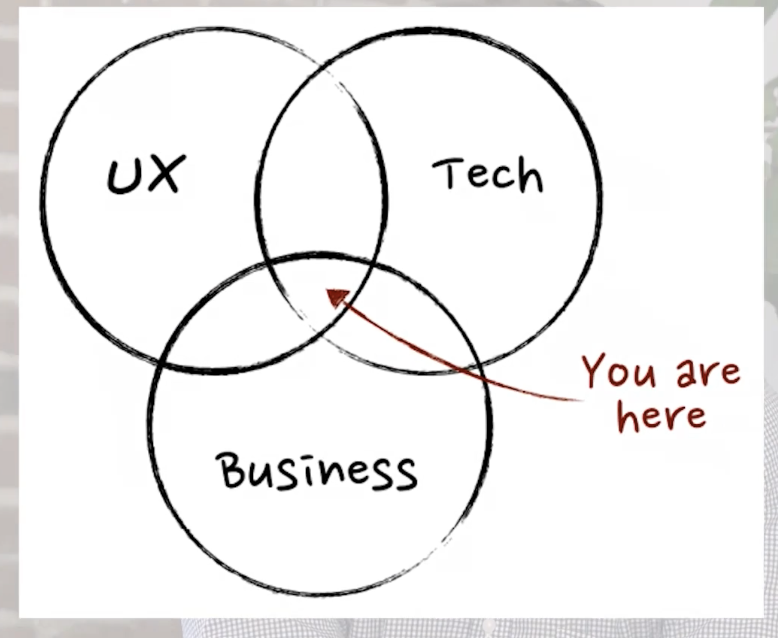

# 01 - What is Product Management?

> "The ambiguity of the product management role is near to its essence."

The Product Manager sits at the intersection of **UX**, **Tech**, and **Business**.

---

## Key Takeaways

### 1. The role is hard to define — and that's the point

- There is no single, concrete definition of product management.
- Responsibilities change across **industries**, **companies**, and **company sizes**.
- What matters are the **core tenets** that remain constant.

### 2. You are NOT a manager of people

- No one reports to you. You can't fire anyone.
- This is **by design**: you need honest, unfiltered feedback from engineers and designers.
- If you were their boss, they wouldn't disagree with you openly.

### 3. You are a communications hub

- You sit **between multiple areas** of the company (engineering, design, sales, legal, etc.).
- You act as an **organizer and enabler** for everyone else.
- You are the "blocker/enabler" — you protect engineers and designers from distractions so they can focus on what they do best.

> *"What do you do?" — "That's the person that stops sales and legal from emailing you."*

### 4. You decide WHAT to build and in WHAT order

- While engineers solve hard technical problems, the PM is:
  - Talking to **stakeholders** and **users**
  - Receiving and analyzing **feedback**
  - Looking at **metrics**
  - Deciding **what to build next** and **what's most important**

### 5. You own the success (or failure) of the product

- If something is wrong with the product, the PM is accountable.
- The PM is ultimately **responsible for the product being successful or not**.

---

## The PM Role in One Line

The PM is a **communications hub**, **prioritizer**, **researcher**, and **presenter** — but most importantly, they are **responsible for the ultimate success of the product**.

---

## Core Functions & Responsibilities (Summary)

| #  | Function                  | Description                                                                 |
|----|---------------------------|-----------------------------------------------------------------------------|
| 1  | **Communication Hub**     | Bridge between engineering, design, sales, legal, leadership, and users     |
| 2  | **Prioritization**        | Decide what gets built and in what order based on impact and feasibility    |
| 3  | **User Research**         | Talk to users, gather feedback, understand pain points                      |
| 4  | **Stakeholder Management**| Align different teams and manage expectations                               |
| 5  | **Metrics & Analysis**    | Use data to inform decisions about what to build                           |
| 6  | **Enabler/Blocker**       | Shield the team from distractions; remove blockers for engineers/designers  |
| 7  | **Product Ownership**     | Own the success or failure of the product                                   |

---

## My Notes

<!-- Add your personal notes, reflections, and questions here -->

-
